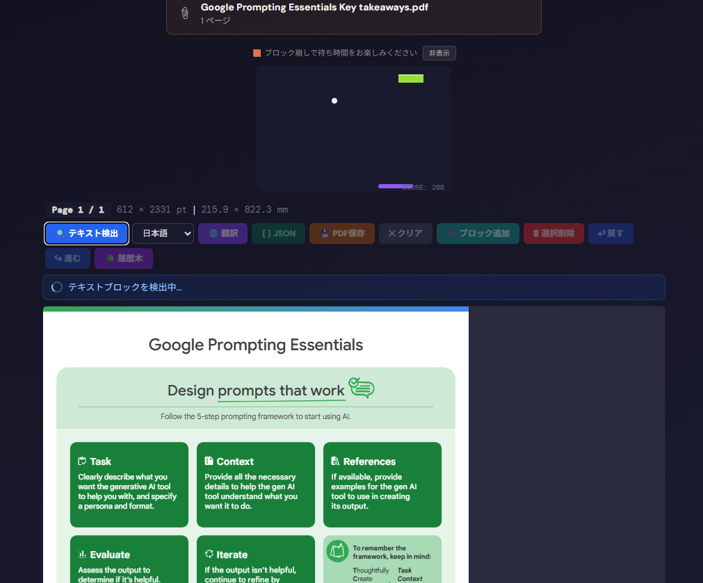
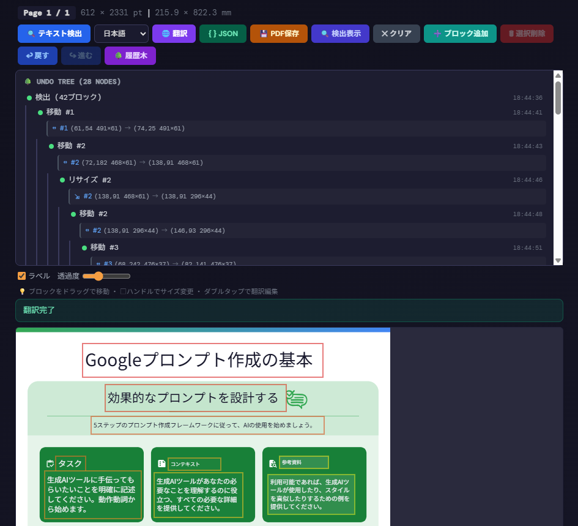

# koneko-pdf

PDF プレビュー + テキストブロック検出 + 翻訳ツール

## 概要

PDF をブラウザ上でプレビューし、Claude API（Vision）を使ってテキストブロックを自動検出・翻訳するシングルページアプリケーション。
検出されたブロックはキャンバス上でドラッグ・リサイズでき、翻訳テキストをオーバーレイ表示して PDF として書き出せる。
※[BASTET](https://v0-bastet-lp.vercel.app/)の機能とほぼ同等

## 主な機能

- **PDF プレビュー** — pdf.js によるページレンダリング（IntersectionObserver で遅延読み込み）
- **テキストブロック検出** — Claude API（Vision）で文書画像からテキスト領域を自動検出
- **翻訳** — 検出ブロックを日本語・英語・中国語・韓国語・仏・独・西に一括翻訳（並列チャンク処理）
- **キャンバス操作** — ブロックのドラッグ移動・8 方向リサイズ・ダブルタップで翻訳編集
- **Undo ツリー** — 線形ではなくツリー構造の編集履歴（分岐あり、任意ノードへ移動可能）
- **PDF エクスポート** — 翻訳オーバーレイ付きのページを JPEG 画像として PDF 1.4 形式で書き出し
- **ミニゲーム** — API 応答待ち中のブロック崩しゲーム  

  
  
  
## 技術スタック

| カテゴリ         | 技術                                 |
| ---------------- | ------------------------------------ |
| フレームワーク   | React 19 + TypeScript 5.9            |
| ビルド           | Vite 7                               |
| スタイリング     | Tailwind CSS 4                       |
| 状態管理         | Zustand 5                            |
| PDF レンダリング | pdfjs-dist 5                         |
| AI API           | Claude API（Sonnet）                 |
| Canvas           | 2 層構造（メイン + オーバーレイ）    |

## プロジェクト構成

```text
app/src/
├── App.tsx                  # ルートコンポーネント
├── main.tsx                 # エントリポイント
├── index.css                # グローバルスタイル（Tailwind テーマ）
│
├── types/                   # TypeScript 型定義
│   ├── blocks.ts            #   BoundingBox, TextBlock, PageSnapshot 等
│   ├── canvas.ts            #   CanvasContainerHandle
│   ├── interaction.ts       #   DragInteraction, ResizeInteraction
│   ├── page.ts              #   PageState, TargetLanguage
│   ├── undo.ts              #   UndoNode
│   └── index.ts             #   再エクスポート
│
├── lib/                     # ユーティリティ・ロジック
│   ├── canvasDrawing.ts     #   オーバーレイ描画（翻訳テキスト・ブロック矩形・ハンドル）
│   ├── claudeApi.ts         #   Claude API 呼び出し（検出・翻訳）
│   ├── colorUtils.ts        #   HSL カラーテーブル生成
│   ├── interactionGeometry.ts #  ヒットテスト・ドラッグ/リサイズ座標計算
│   ├── jsonParser.ts        #   API レスポンスの JSON 修復パーサー
│   ├── pdfExport.ts         #   PDF 1.4 手動構築・ダウンロード
│   ├── pdfUtils.ts          #   用紙サイズ判定・ユーティリティ
│   └── UndoTree.ts          #   ツリー構造の Undo/Redo 管理
│
├── stores/                  # Zustand ストア
│   ├── useAppStore.ts       #   アプリ全体（API キー・PDF 情報・ローディング）
│   └── usePageStore.ts      #   ページ単位（ブロック・翻訳・表示設定）
│
├── hooks/                   # カスタムフック
│   ├── useKeyboardShortcuts.ts #  Delete/Backspace によるブロック削除
│   ├── usePageActions.ts    #   検出・翻訳・エクスポート等のアクション
│   ├── usePageRenderer.ts   #   IntersectionObserver + pdf.js ページ描画
│   ├── usePdfLoader.ts      #   PDF ファイル読み込み・ページ初期化
│   ├── usePointerInteraction.ts # マウス/タッチのドラッグ・リサイズ・選択
│   └── useUndoTree.ts       #   Undo ツリーのスナップショット管理
│
└── components/              # React コンポーネント
    ├── Header.tsx           #   アプリヘッダー
    ├── ApiKeyInput.tsx      #   API キー入力
    ├── DropZone.tsx         #   PDF ファイルドロップゾーン
    ├── ErrorBoundary.tsx    #   エラーバウンダリ
    ├── ErrorMessage.tsx     #   エラー通知（5 秒で自動消去）
    ├── FileInfo.tsx         #   ファイル名・ページ数表示
    ├── ProgressBar.tsx      #   読み込み進捗バー
    ├── Spinner.tsx          #   ローディングスピナー
    ├── PageList.tsx         #   ページ一覧
    ├── PageBlock/           #   ページブロック（サブコンポーネント群）
    │   ├── PageBlock.tsx    #     メインコンポーネント
    │   ├── PageHeader.tsx   #     ページ番号・用紙サイズ
    │   ├── PageActions.tsx  #     アクションボタン群
    │   ├── CanvasContainer.tsx #   2 層キャンバス（forwardRef）
    │   ├── BlockList.tsx    #     ブロック一覧
    │   ├── BlockItem.tsx    #     個別ブロック表示
    │   ├── OverlayControls.tsx #   ラベル表示・透過度スライダー
    │   ├── StatusIndicator.tsx #   ステータス表示
    │   └── UndoTreePanel.tsx #    Undo ツリー可視化
    ├── modals/
    │   ├── JsonViewerModal.tsx #   JSON ビューア
    │   └── TranslationEditModal.tsx # 翻訳編集モーダル
    └── game/
        └── BreakoutGame.tsx #   ブロック崩しミニゲーム
```

## セットアップ

```bash
cd app  
npm install
npm run dev
```

<http://localhost:5173> で開発サーバーが起動する。

## ビルド

```bash
npm run build
```

`dist/` に静的ファイルが出力される。

## 使い方

1. Claude API キーを入力（`sk-ant-...`）
2. PDF ファイルをドラッグ＆ドロップまたはクリックで選択
3. 各ページの「検出」ボタンでテキストブロックを自動検出
4. 言語を選択して「翻訳」ボタンで一括翻訳
5. ブロックをドラッグで移動、ハンドルでリサイズ、ダブルタップで翻訳を直接編集
6. 「保存」ボタンで翻訳オーバーレイ付き PDF をダウンロード

## キーボードショートカット

| キー                     | 操作                     |
| ------------------------ | ------------------------ |
| `Delete` / `Backspace`   | 選択中のブロックを削除   |

## アーキテクチャ

### 状態管理

Zustand による 2 ストア構成:

- **useAppStore** — グローバル状態（API キー、PDF ドキュメント、ローディング、エラー）
- **usePageStore** — ページ単位の状態（ブロック、翻訳、表示設定、選択状態）

### キャンバス描画

2 層キャンバス構造:

- **メインキャンバス** — pdf.js による PDF ページレンダリング（DPR 対応）
- **オーバーレイキャンバス** — テキストブロックの矩形・翻訳テキスト・ハンドルの描画

描画パフォーマンスのために以下のキャッシュを使用:

- カラーテーブル（HSL → RGB 事前計算）
- テキストレイアウト（二分探索によるフォントサイズ最適化）
- 背景色サンプリング（エッジピクセルからの推定）

### Undo ツリー

線形スタックではなくツリー構造の編集履歴を採用。
分岐操作（Undo 後に別の編集を行う）で履歴が枝分かれし、任意のノードに直接ジャンプできる。

### API 連携

- **検出**: Claude Sonnet（Vision）に PDF ページ画像を送信し、正規化座標でテキストブロックを取得
- **翻訳**: ブロックをチャンク分割（10 件/チャンク）し、3 並列ワーカーで同時翻訳
